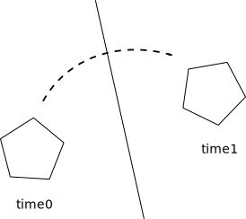
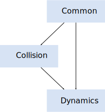

# Overview
Box2D is a 2D rigid body simulation library for games. Programmers can
use it in their games to make objects move in realistic ways and make
the game world more interactive. From the game engine's point of view,
a physics engine is just a system for procedural animation.

Box2D is written in portable C++. Most of the types defined in the
engine begin with the b2 prefix. Hopefully this is sufficient to avoid
name clashing with your game engine.

## Prerequisites
In this manual I'll assume you are familiar with basic physics
concepts, such as mass, force, torque, and impulses. If not, please
first consult Google search and Wikipedia.

Box2D was created as part of a physics tutorial at the Game Developer
Conference. You can get these tutorials from the download section of
box2d.org.

Since Box2D is written in C++, you are expected to be experienced in C++
programming. Box2D should not be your first C++ programming project! You
should be comfortable with compiling, linking, and debugging.

> **Caution**:
> Box2D should not be your first C++ project. Please learn C++
> programming, compiling, linking, and debugging before working with
> Box2D. There are many resources for this on the net.

## Scope
This manual covers the majority of the Box2D API. However, not every
aspect is covered. Please look at the testbed included
with Box2D to learn more.

This manual is only updated with new releases. The latest version of
Box2D may be out of sync with this manual.

## Feedback and Bugs
Please file bugs and feature requests here:
[Box2D Issues](https://github.com/erincatto/box2d/issues)

You can help to ensure your issue gets fixed if you provide sufficient
detail. A testbed example that reproduces the problem is ideal. You can
read about the testbed later in this document.

There is also a [Discord server](https://discord.gg/NKYgCBP) and a
[subreddit](https://reddit.com/r/box2d) for Box2D.

## Core Concepts
Box2D works with several fundamental concepts and objects. We briefly
define these objects here and more details are given later in this
document.

#### shape
A shape is 2D geometrical object, such as a circle or polygon.

#### rigid body
A chunk of matter that is so strong that the distance between any two
bits of matter on the chunk is constant. They are hard like a diamond.
In the following discussion we use body interchangeably with rigid body.

#### fixture
A fixture binds a shape to a body and adds material properties such as
density, friction, and restitution. A fixture puts a shape into the
collision system (broad-phase) so that it can collide with other shapes.

#### constraint
A constraint is a physical connection that removes degrees of freedom
from bodies. A 2D body has 3 degrees of freedom (two translation
coordinates and one rotation coordinate). If we take a body and pin it
to the wall (like a pendulum) we have constrained the body to the wall.
At this point the body can only rotate about the pin, so the constraint
has removed 2 degrees of freedom.

#### contact constraint
A special constraint designed to prevent penetration of rigid bodies and
to simulate friction and restitution. You do not create contact
constraints; they are created automatically by Box2D.

#### joint
This is a constraint used to hold two or more bodies together. Box2D
supports several joint types: revolute, prismatic, distance, and more.
Some joints may have limits and motors.

#### joint limit
A joint limit restricts the range of motion of a joint. For example, the
human elbow only allows a certain range of angles.

#### joint motor
A joint motor drives the motion of the connected bodies according to the
joint's degrees of freedom. For example, you can use a motor to drive
the rotation of an elbow.

#### world
A physics world is a collection of bodies, fixtures, and constraints
that interact together. Box2D supports the creation of multiple worlds,
but this is usually not necessary or desirable.

#### solver
The physics world has a solver that is used to advance time and to
resolve contact and joint constraints. The Box2D solver is a high
performance iterative solver that operates in order N time, where N is
the number of constraints.

#### continuous collision
The solver advances bodies in time using discrete time steps. Without
intervention this can lead to tunneling.


Box2D contains specialized algorithms to deal with tunneling. First, the
collision algorithms can interpolate the motion of two bodies to find
the first time of impact (TOI). Second, there is a sub-stepping solver
that moves bodies to their first time of impact and then resolves the
collision.

## Modules
Box2D is composed of three modules: Common, Collision, and Dynamics. The
Common module has code for allocation, math, and settings. The Collision
module defines shapes, a broad-phase, and collision functions/queries.
Finally the Dynamics module provides the simulation world, bodies,
fixtures, and joints.


## Units
Box2D works with floating point numbers and tolerances have to be used
to make Box2D perform well. These tolerances have been tuned to work
well with meters-kilogram-second (MKS) units. In particular, Box2D has
been tuned to work well with moving shapes between 0.1 and 10 meters. So
this means objects between soup cans and buses in size should work well.
Static shapes may be up to 50 meters long without trouble.

Being a 2D physics engine, it is tempting to use pixels as your units.
Unfortunately this will lead to a poor simulation and possibly weird
behavior. An object of length 200 pixels would be seen by Box2D as the
size of a 45 story building.

> **Caution**: 
> Box2D is tuned for MKS units. Keep the size of moving objects roughly
> between 0.1 and 10 meters. You'll need to use some scaling system when
> you render your environment and actors. The Box2D testbed does this by
> using an OpenGL viewport transform. DO NOT USE PIXELS.

It is best to think of Box2D bodies as moving billboards upon which you
attach your artwork. The billboard may move in a unit system of meters,
but you can convert that to pixel coordinates with a simple scaling
factor. You can then use those pixel coordinates to place your sprites,
etc. You can also account for flipped coordinate axes.

Box2D uses radians for angles. The body rotation is stored in radians
and may grow unbounded. Consider normalizing the angle of your bodies if
the magnitude of the angle becomes too large (use b2Body::SetAngle).

> **Caution**:
> Box2D uses radians, not degrees.

## Factories and Definitions
Fast memory management plays a central role in the design of the Box2D
API. So when you create a b2Body or a b2Joint, you need to call the
factory functions on b2World. You should never try to allocate these
types in another manner.

There are creation functions:

```cpp
b2Body* b2World::CreateBody(const b2BodyDef* def)
b2Joint* b2World::CreateJoint(const b2JointDef* def)
```

And there are corresponding destruction functions:

```cpp
void b2World::DestroyBody(b2Body* body)
void b2World::DestroyJoint(b2Joint* joint)
```

When you create a body or joint, you need to provide a definition. These
definitions contain all the information needed to build the body or
joint. By using this approach we can prevent construction errors, keep
the number of function parameters small, provide sensible defaults, and
reduce the number of accessors.

Since fixtures (shapes) must be parented to a body, they are created and
destroyed using a factory method on b2Body:

```cpp
b2Fixture* b2Body::CreateFixture(const b2FixtureDef* def)
void b2Body::DestroyFixture(b2Fixture* fixture)
```

There is also shortcut to create a fixture directly from the shape and
density.

```cpp
b2Fixture* b2Body::CreateFixture(const b2Shape* shape, float density)
```

Factories do not retain references to the definitions. So you can create
definitions on the stack and keep them in temporary resources.
